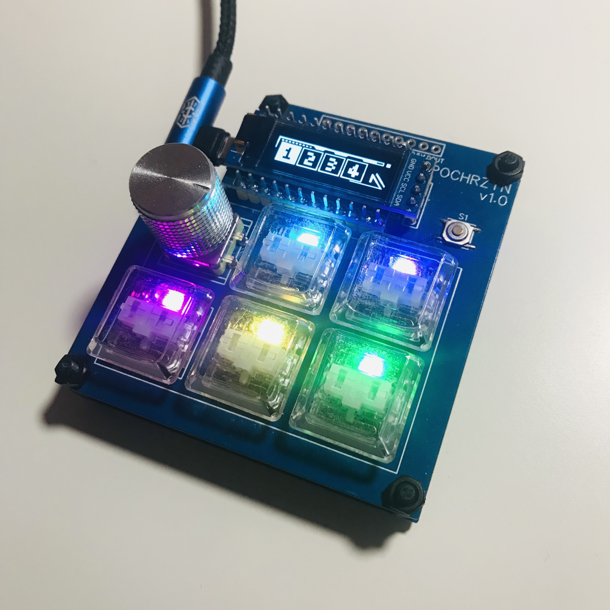
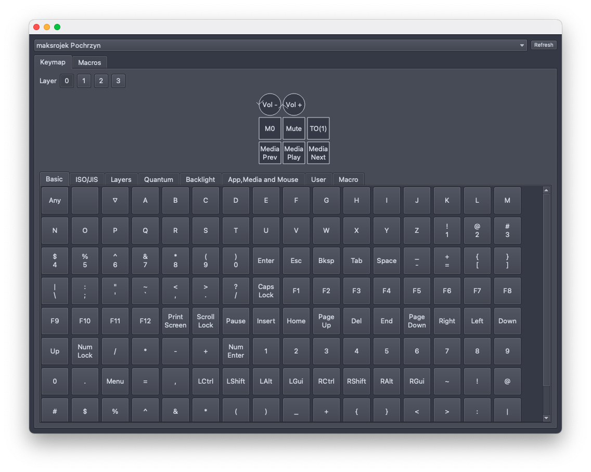
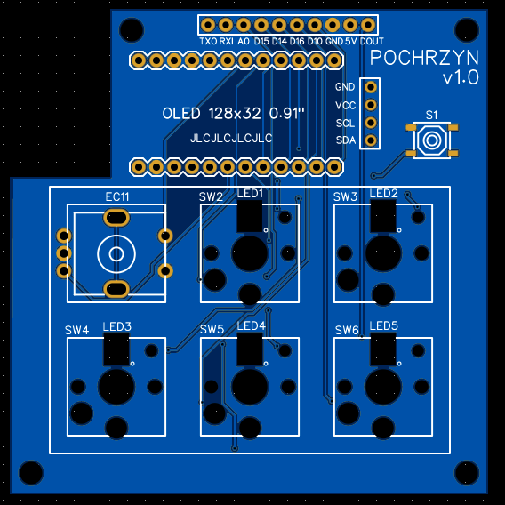
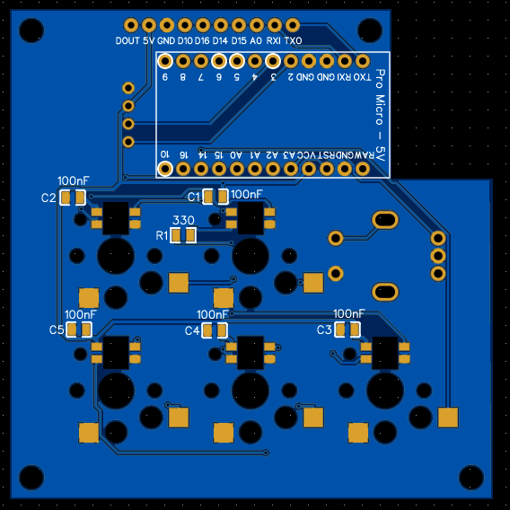

# Pochrzyn

**Open-source 6-key macropad with rotary encoder, RGB lights &amp; OLED screen.**

**Features:**
- 5 hot swappable, low profile mechanical switches. Compatible with:
  - **Kailh Chocolate (Choc) V1 Low Profile (PG1350)**
  - **Kailh Chocolate (Choc) V2 Low Profile (PG1353)**
- rotary encoder with push button
- 5 RGB lights under mechanical switches
- 128x32 OLED screen



## Configuring keyboard layout
### Using GUI - [Vial](https://get.vial.today/)

Keyboard configuration can be done using GUI [Vial](https://get.vial.today/).
It's available for Windows, Linux and Mac. It supports: changing key codes for all the
switches and rotary encoder, creating up to 15 user defined macros.

If your keyboard has been already flashed with the firmware that supports Vial, you should be
able to just plug in your keyboard and start customizing. The Vial App should automatically
recognize the macropad, allowing you to change any key and encoder value.



If for any reason Vial does not recognize your keyboard, you can flash the firmware available 
in this repository: `pochrzyn_via.hex`.

Use [QMK Toolbox](https://github.com/qmk/qmk_toolbox) for easy flashing.
If you have any problem refer to the [QMK docs](https://docs.qmk.fm/#/newbs_flashing).

### Writing custom code

First, set up your [build environment](https://get.vial.today/gettingStarted/porting-to-vial.html).

Next, copy the insides of the folder `vial`, that you can find in this repository, to the `vial-qmk/keyboards`.
Your folder structure in the `vial_qmk` should look like this:
```
.
|____keyboards
  |____pochrzyn
    |____config.h
    |____keymaps
    | |____via
    |   |____keymap.c
    |   |____vial.json
    |   |____rules.mk
    |____pochrzyn.c
    |____info.json
    |____rules.mk
    |____pochrzyn.h
```

Now you can make any changes you want to the files, like writing custom encoder behaviour, 
drawing on the OLED screen. Refer to the [QMK docs](https://docs.qmk.fm/) for a list of all available 
features and [Vial docs](https://get.vial.today/) for any Vial related features.

Compile the **via** keymap using the command:
```shell
make pochrzyn:via
```
Next step is to flash the firmware file `pochrzyn_via.hex`. 
Use [QMK Toolbox](https://github.com/qmk/qmk_toolbox) for easy flashing.
If you have any problem refer to the [QMK docs](https://docs.qmk.fm/#/newbs_flashing).


## Build your own

**1. Get the PCB**

The gerber file can be found here `hardware/production/Gerber_PCB.zip`.

I've also included the EasyEDA project (`hardware/easyeda/Pochrzyn_EasyEDA.zip`), 
so it can be imported there to modify.

|  |   |
| --- | --- |


**2. Needed parts**

You can find the list of parts in the `hardware/production/bom.csv` file.

**3. Flashing firmware**

After assembly, you can flash the firmware included in this repo `pochrzyn_via.hex`
using [QMK Toolbox](https://github.com/qmk/qmk_toolbox) or compile it on your own - 
refer to section [Writing custom code](#writing-custom-code).
